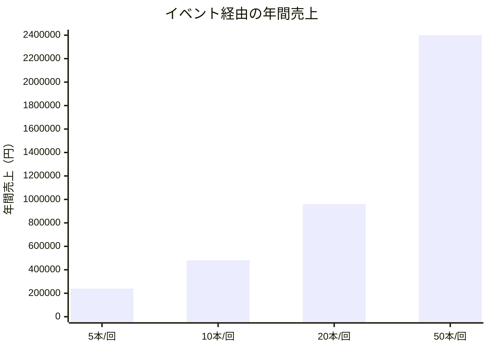
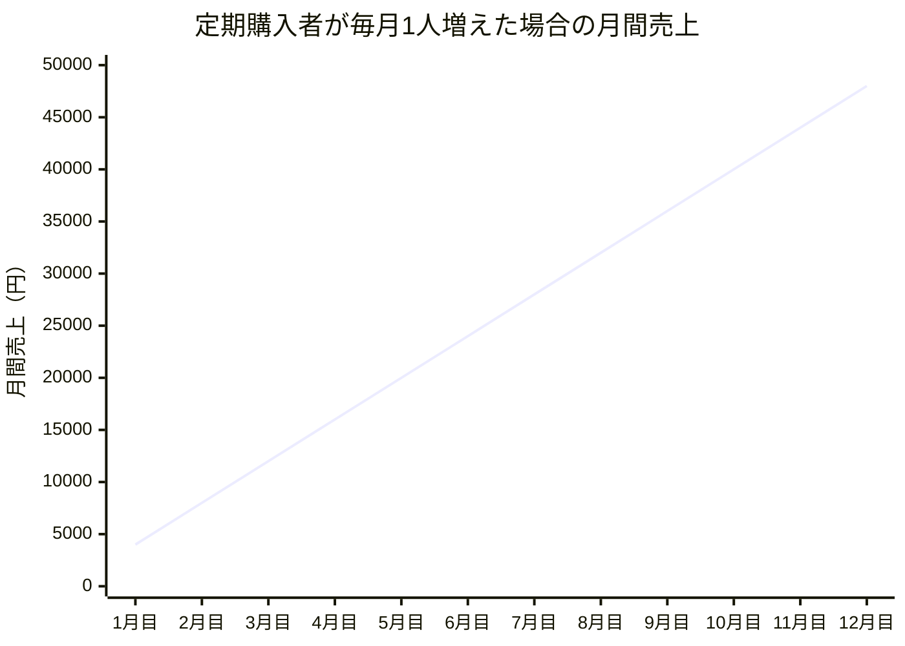
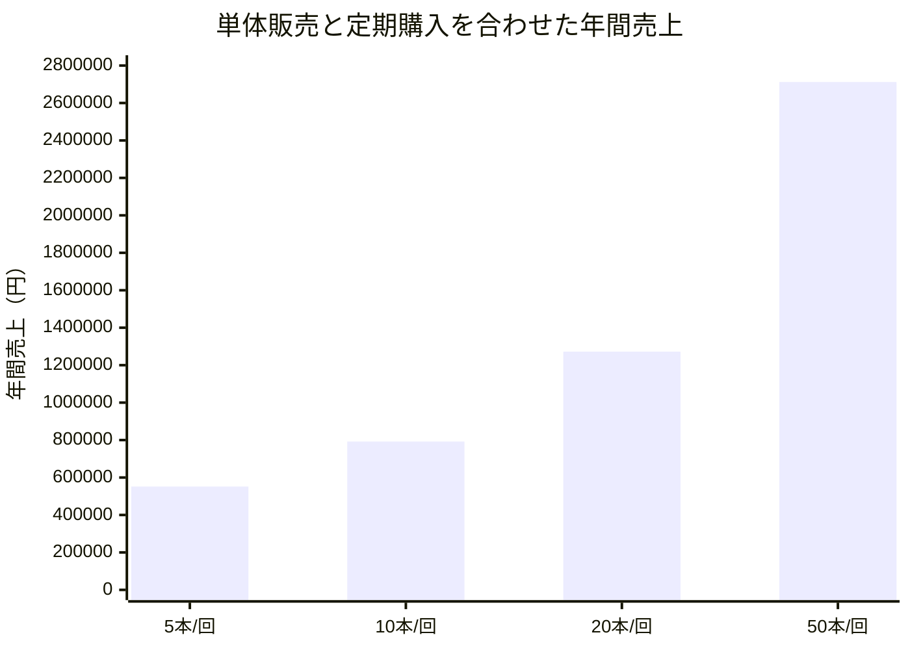

# SlowBase 現状報告  
## 既存顧客の支援から、次の事業の形を探る

---

## 1. SlowBaseの軸

SlowBaseの根本にある考え方はここです。

> 唯一無二の価値を  
> あるべき姿に

まだ言葉になっていない魅力がある。  
まだ誰にも見せていない景色がある。

SlowBaseは、自然・地域・生業・体験の中にある価値を見つけて、  
伝わる形に整えて、成果につなげていく会社です。

前提として、SlowBaseはイベント運営会社ではありません。

今回整理したいのは、イベントをやるかどうかではなく、  
**既存顧客の中にある価値を、売上につながる形にできるか**  
という話です。

---

## 2. 現状の整理

### 2-1. 新規事業の状況

現状、SlowBaseの新しい動きとして、お酒関連の支援や撮影営業を進めています。

ただ、正直なところ、現時点では大きく進んでいるとは言いづらいです。

お酒の事業も、まだ具体的な売上につながっている段階ではありません。  
撮影営業も、そこから自然に紹介や追加案件が生まれる状態にはなっていません。

なので、今の段階で  
「撮影を取れば、その後の仕事も広がる」  
と考えすぎるのは少し危ないと思っています。

---

### 2-2. 今後の方向性

現実的なヒントとして見たいのが、  
今すでに動いている既存顧客の支援です。

その中の一つが、餅田農園のSERAMADEです。

SERAMADEでは、すでに以下の支援を行っています。

- SNS運用支援
- ECでの販売支援
- 商品の見せ方の整理
- 販売導線の改善

この支援の中で、ヨガイベントへの協賛という動きが出てきました。

ここで見たいのは、イベントそのものではありません。

見たいのは、  
**既存顧客の商品が、リアルな接点を通じて売上につながるか**  
です。

ここに、SlowBaseとして今後広げられるヒントがあると思っています。

---

## 3. 既存顧客支援の一例

### 3-1. SERAMADEで起きている動き

先日、Walklog社が運営するヨガイベントに協賛し、  
SERAMADEの商品を出品しました。

出品した商品は、青パパイヤドリンクなどです。

イベントには、健康や美容、体のケアに関心がある人が集まります。  
そのため、SERAMADEの商品との相性は悪くないと感じています。

今後も以下の日程で、継続して出品できる可能性があります。

- 7月25日
- 8月22日

毎回50人前後が来場するイベントなので、  
小さく検証するにはちょうど良い場です。

---

### 3-2. 反応と実績

実施後、SNS上で少し反応が出ました。  
商品への印象も悪くなく、興味を持ってもらえる感覚はありました。

売上としては、単体で5本の販売実績が出ています。  
また、過去にはイベントをきっかけに定期購入につながった実績もあります。

SERAMADEのドリンクは1本4,000円です。

つまり、5本売れると20,000円です。

金額だけ見ると大きくはありませんが、  
この取り組みは単発売上だけで見るものではないと思っています。

大事なのは、  
**イベントをきっかけに、購入や定期購入につながる流れを作れるか**  
です。

---

## 4. 売上シミュレーション

SERAMADEのドリンク単価は4,000円です。  
月1回のイベントに継続して出品できるとした場合、売上は以下のように見えます。

| 1回あたり販売本数 | 1回あたり売上 | 年間売上（月1回） |
|---:|---:|---:|
| 5本 | 20,000円 | 240,000円 |
| 10本 | 40,000円 | 480,000円 |
| 20本 | 80,000円 | 960,000円 |
| 50本 | 200,000円 | 2,400,000円 |

### グラフ：イベント経由の年間売上イメージ



最初から50本を狙う必要はありません。

5本。  
次に10本。  
そこから20本。

このように、毎回の見せ方や導線を改善していけば、  
餅田農園側の売上に少しずつ効いてくる可能性があります。

仮に50人前後が来るイベントで50本売れる状態を作れれば、  
1回あたり200,000円、年間では2,400,000円の売上になります。

ここまで見えてくると、  
餅田農園としてもこの取り組みに投資する意味が出てきます。

---

## 5. 定期購入が取れるとさらに大きい

今回の取り組みで一番見たいのは、  
当日の販売本数だけではありません。

定期購入につながるかどうかです。

SERAMADEのドリンクを月1本購入してもらうと、  
1人あたりの年間売上は以下です。

```text
4,000円 × 12ヶ月 = 48,000円
```

つまり、定期購入者が1人増えるだけで、  
年間48,000円の売上になります。

イベントごとに1人でも定期購入者が増えれば、  
その人だけで年間48,000円の売上です。

毎月1人ずつ定期購入者が増えれば、  
イベント当日の販売以上に、餅田農園側の売上インパクトは大きくなります。

だからこそ、この施策は、  
その日に何本売れたかだけで判断しない方が良いです。

見るべきなのは、  
継続購入につながるお客様を作れるかどうかです。

---

## 6. グラフ用データ：定期購入の積み上がり

イベントごとに1人ずつ定期購入者が増えた場合、  
1年目の売上イメージは以下です。

| 月 | 定期購入者数 | 月間売上 |
|---:|---:|---:|
| 1ヶ月目 | 1人 | 4,000円 |
| 2ヶ月目 | 2人 | 8,000円 |
| 3ヶ月目 | 3人 | 12,000円 |
| 4ヶ月目 | 4人 | 16,000円 |
| 5ヶ月目 | 5人 | 20,000円 |
| 6ヶ月目 | 6人 | 24,000円 |
| 7ヶ月目 | 7人 | 28,000円 |
| 8ヶ月目 | 8人 | 32,000円 |
| 9ヶ月目 | 9人 | 36,000円 |
| 10ヶ月目 | 10人 | 40,000円 |
| 11ヶ月目 | 11人 | 44,000円 |
| 12ヶ月目 | 12人 | 48,000円 |

### グラフ：定期購入の積み上がり



この場合、1年目の定期購入売上は合計で312,000円になります。

```text
4,000円 + 8,000円 + 12,000円 + 16,000円 + 20,000円 + 24,000円
+ 28,000円 + 32,000円 + 36,000円 + 40,000円 + 44,000円 + 48,000円
= 312,000円
```

単体販売に加えて定期購入が取れれば、  
売上はより積み上がりやすくなります。

---

## 7. 単体販売と定期購入を合わせた場合

単体販売に、毎月1名ずつ定期購入者が増える想定を加えると、  
年間売上は以下のようになります。

| ケース | 単体販売の年間売上 | 定期購入の年間売上 | 合計年間売上 |
|---|---:|---:|---:|
| 5本 / 回 | 240,000円 | 312,000円 | 552,000円 |
| 10本 / 回 | 480,000円 | 312,000円 | 792,000円 |
| 20本 / 回 | 960,000円 | 312,000円 | 1,272,000円 |
| 50本 / 回 | 2,400,000円 | 312,000円 | 2,712,000円 |

### グラフ：単体販売＋定期購入の年間売上



この数字を見ると、  
イベントでの販売数が増えるほど、餅田農園にとっての意味も大きくなります。

20本売れる状態までいけば、  
定期購入込みで年間1,272,000円。

50本売れる状態までいけば、  
定期購入込みで年間2,712,000円です。

ここまで見えると、  
販促施策として続ける意味が出てきます。

---

## 8. SlowBaseとして見たいこと

今回の取り組みで、SlowBaseとして見たいのは以下です。

- 既存顧客の商品がリアルイベントで受け入れられるか
- SNSの反応が販売につながるか
- QRコードからECやInstagramに流せるか
- 単体購入だけでなく定期購入につながるか
- イベント後に改善点を見つけられるか
- その改善で次回の売上が上がるか

ここで結果が出れば、  
SlowBaseとして既存顧客に対する支援価値を見せやすくなります。

また、餅田農園側の売上が見えてくれば、  
将来的に以下の費用をいただく流れも作りやすくなります。

- 販促物制作費
- SNS運用費
- EC導線改善費
- イベント出品に関する運営支援費
- 月次レポート費
- 月次改善提案費

何度も言うように、  
SlowBaseはイベント運営会社ではありません。

イベントをやることが目的ではなく、  
**イベントをきっかけに売上につながる導線を作れるか**  
を見ることが目的です。

---

## 9. Walklogとの今後の可能性

今回のヨガイベントは、Walklog社との接点にもなっています。

Walklog代表の樋高さんは元Amazon出身で、ECの知見があります。  
今後、Walklog側でもECを作っていく予定があります。

そのため、今後の話としては、  
単にイベントに商品を出すだけではなく、以下のような領域にも広がる可能性があります。

- ECでの商品ページ設計
- 商品説明文の整理
- SNSからECへの導線設計
- イベントからECへの導線設計
- 出品ブランドの見せ方整理
- 販売後のリピート導線

ここは、SlowBaseとしても相性があります。

撮影だけではなく、  
商品やブランドが売れる形を整える支援として関われる可能性があるためです。

---

## 10. 次にやること

直近では、7月25日と8月22日の2回で検証します。

### 7月25日

出してみる回です。

見ることは以下です。

- 何人が興味を持つか
- 何人が試飲するか
- 何本売れるか
- QRコードが読み込まれるか
- InstagramやECに流せるか
- 定期購入につながるか

### 8月22日

7月の結果をもとに改善します。

改善することは以下です。

- POPの見せ方
- 商品説明の言葉
- QRコードの置き方
- SNS投稿内容
- ECへの誘導方法
- 当日の声かけ
- イベント後のフォロー

この2回で、  
既存顧客の商品がイベント経由で売上につながるかを見ます。

---

## 11. 毎回記録する数字

感覚だけで判断しないように、毎回以下を記録します。

| 項目 | 見る理由 |
|---|---|
| 来場者数 | どれくらい接点を作れたか |
| 試飲数 | 商品に興味を持ってもらえたか |
| 販売本数 | その場で購入された数 |
| 売上金額 | 餅田農園への売上貢献 |
| QRコード読み込み数 | ECやSNSへの導線が機能したか |
| Instagramフォロー数 | 継続接点が作れたか |
| EC流入数 | イベントから購入ページへ送れたか |
| 定期購入件数 | 継続売上につながったか |
| イベント後の問い合わせ数 | 後追いの反応があったか |
| 次回購入見込み | 次回改善の材料 |

この数字を残せば、  
次回どう改善すれば良いかが見えます。

餅田農園に対しても、  
「今回これだけ売れました」だけでなく、  
「次回はここを変えると伸びそうです」  
と返せます。

---

## 12. まとめ

今回の資料で伝えたいことは、シンプルです。

SlowBaseはイベント運営会社ではありません。

今回整理しているのは、  
既存顧客の中で、SNS運用、EC販売支援、リアルイベントでの反応を見ながら、  
売上につながる導線を作れるかを試す取り組みです。

現状、お酒の支援や撮影営業から大きく案件が広がっているわけではありません。

だからこそ、  
今すでに動いている既存顧客の事例から、  
SlowBaseが今後目指す方向のヒントを見つけたいです。

既存顧客の売上を上げる。  
その実績をもとに、支援価値を見せる。  
将来的には、販促物制作、SNS運用、EC導線改善、月次改善支援として費用をいただける状態にする。

この流れが作れれば、  
SlowBaseとして撮影だけに頼らない仕事の形が見えてきます。
