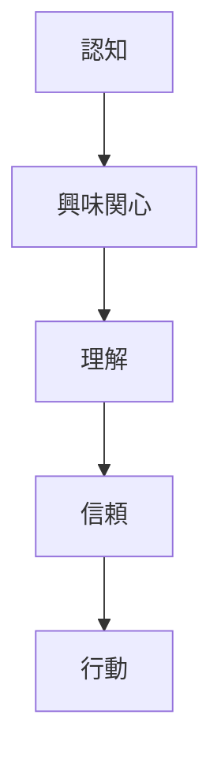
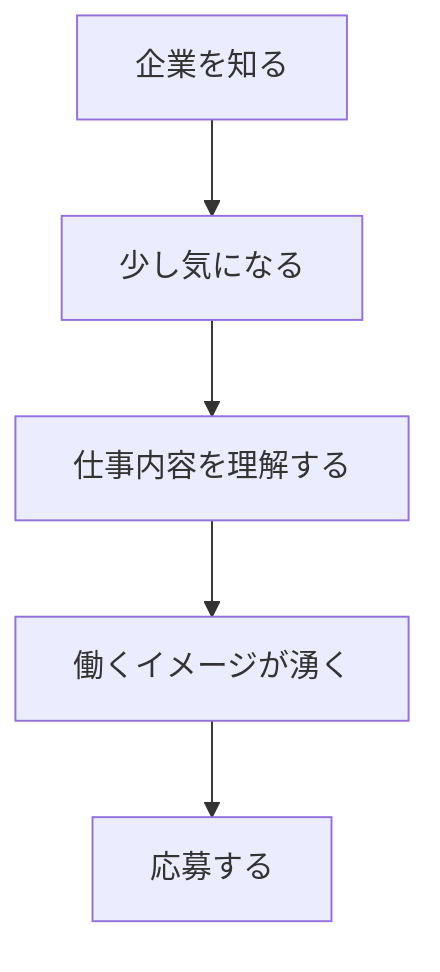
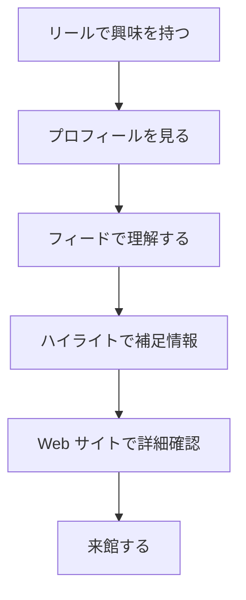
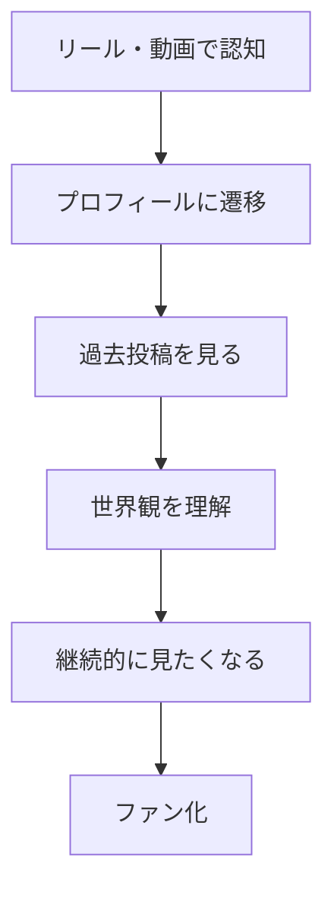
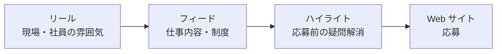
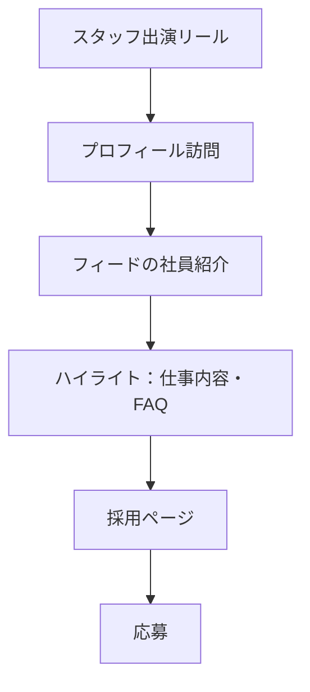

# Instagram 採用運用ガイド

> TikTok との違い・機能設計・事例から見る運用ロジック

**最終更新:** 2026年6月

---

## 要点サマリー

| 観点 | 結論 |
|------|------|
| TikTok の役割 | **見つけてもらう** — 新規認知・拡散 |
| Instagram の役割 | **信頼してもらう** — 理解促進・応募前の不安解消 |
| 運用の本質 | 投稿数ではなく **ユーザー導線の設計** |
| リール | 新規認知の **入口** |
| フィード | 企業理解・信頼の **蓄積** |
| ストーリー | 日常接点・親近感の **維持** |
| ハイライト | 情報整理・次の行動への **誘導** |
| Web サイト | 意思決定・**コンバージョン** |

---

## 目次

1. [このドキュメントの目的](#1-このドキュメントの目的)
2. [前提：SNS 運用は「投稿」が目的ではない](#2-前提sns-運用は投稿が目的ではない)
3. [TikTok と Instagram の構造的な違い](#3-tiktok-と-instagram-の構造的な違い)
4. [役割比較一覧](#4-役割比較一覧)
5. [Instagram 運用の本質 — ユーザーフロー](#5-instagram-運用の本質--ユーザーフロー)
6. [各機能の役割と使い分け](#6-各機能の役割と使い分け)
7. [運用ルールの基本設計](#7-運用ルールの基本設計)
8. [事例：TDK 歴史みらい館](#8-事例tdk-歴史みらい館)
9. [事例：Virtual Baba](#9-事例virtual-baba)
10. [事例：砂建](#10-事例砂建)
11. [スタッフ出演の使い分け（TikTok → Instagram）](#11-スタッフ出演の使い分けtiktok--instagram)
12. [Instagram 運用の全体設計](#12-instagram-運用の全体設計)
13. [具体的なシミュレーション](#13-具体的なシミュレーション)
14. [最終結論](#14-最終結論)

---

## 1. このドキュメントの目的

企業が **採用目的で Instagram を活用する際の考え方** を整理するためのドキュメントです。

### 整理する論点

- Instagram と TikTok の役割の違い
- Instagram 各機能（リール / フィード / ストーリー / ハイライト / Web）の使い分け
- 採用目的における Instagram 運用の本質
- TDK 歴史みらい館・Virtual Baba・砂建の事例から見える共通構造
- 企業アカウントとして Instagram を運用する際の判断基準

---

## 2. 前提：SNS 運用は「投稿」が目的ではない

企業 SNS 運用の議論では、以下のような **具体施策** に話が寄りがちです。

- リールを何本投稿するか
- ストーリーを毎日更新するか
- フィードのデザインを統一するか
- フォロワーを増やすか
- バズる企画を作るか

しかし、本質的には SNS 運用の目的は **「投稿」そのものではありません**。

### SNS が目指す最終行動

- 来館
- 購買
- 問い合わせ
- **採用応募**
- ファン化
- 継続的な接点形成

> **SNS は単体で完結するものではなく、企業とユーザーの関係性を深めるための「導線設計の一部」として捉える。**

---

## 3. TikTok と Instagram の構造的な違い

どちらも短尺動画を活用できる SNS ですが、**プラットフォームとしての役割は異なります**。

### 3.1 TikTok — 発見されるためのプラットフォーム

ユーザーはおすすめ欄を中心に次々と動画を視聴するため、**知らない人にコンテンツを届けやすく、新規認知を獲得しやすい** 特徴があります。

| 得意 | 弱み |
|------|------|
| 新規認知の獲得 | 企業理解の蓄積 |
| 拡散・話題化 | 情報整理 |
| トレンド活用 | 比較検討 |
| 人柄・雰囲気の訴求 | 採用情報の体系的な提示 |
| 短時間での興味喚起 | 応募前の不安解消 |

### 3.2 Instagram — 興味を深めてもらうためのプラットフォーム

リールで興味を持ったユーザーが、**プロフィール → フィード → ハイライト → 外部リンク** へと移動しやすい構造です。

| 得意 | 強みの源泉 |
|------|-----------|
| 世界観の蓄積 | リール・フィード・ストーリー・ハイライト・Web を連携 |
| 企業理解の促進 | ユーザーを回遊させる設計 |
| 信頼形成 | |
| 採用情報の整理 | |
| 応募前の不安解消 | |
| Web サイト・応募フォームへの導線設計 | |

---

## 4. 役割比較一覧

| 項目 | TikTok | Instagram |
|------|--------|-----------|
| **主な役割** | 新規認知・拡散 | 理解促進・信頼形成 |
| **ユーザー行動** | おすすめ欄で動画を見る | プロフィールや過去投稿も確認する |
| **強み** | 知らない人に届きやすい | 情報を蓄積しやすい |
| **向いている内容** | スタッフ出演、社内の雰囲気、あるある、トレンド | 仕事内容、社員紹介、制度、実績、応募導線 |
| **採用での役割** | 興味を持たせる | 応募前の不安を下げる |
| **成果に近い導線** | 認知・話題化 | 比較検討・応募前確認 |

---

## 5. Instagram 運用の本質 — ユーザーフロー

Instagram 運用の本質は、投稿を伸ばすことではなく、ユーザーを **認知 → 興味 → 理解 → 信頼 → 行動** へ導くことです。

### 一般フロー



### 採用に置き換えたフロー



> 各機能を独立して考えるのではなく、**それぞれがどの段階を担うのか** を設計する。

---

## 6. 各機能の役割と使い分け

### 6.1 リール — 新規認知の入口

| | |
|---|---|
| **役割** | 新規認知を獲得する入口 |
| **目的** | まだ企業を知らない人に対して、最初の接点を作る |

**向いている内容:** 仕事の迫力 / 社員の人柄 / 現場のリアル / 意外性のある仕事紹介 / 会社の雰囲気 / 短尺ビフォーアフター

**採用での活用例:**
- 「未経験入社1年目のリアル」
- 「現場職の朝はこんな感じ」
- 「怖そうに見える先輩、実は優しい」
- 「この仕事、実はこんな技術が必要です」
- 「1日でここまで現場が変わる」

---

### 6.2 フィード — 企業理解を深める場所

| | |
|---|---|
| **役割** | 企業理解を深める場所 |
| **目的** | リールやプロフィールから訪れた人に、会社の情報を整理して伝える |

**向いている内容:** 社員紹介 / 仕事内容 / 事業内容 / 教育制度 / 福利厚生 / キャリアステップ / 施工実績 / 代表メッセージ

**採用での活用例:**
- 「未経験から一人前になるまで」
- 「資格取得支援について」
- 「社員インタビュー」
- 「職種別の仕事内容」
- 「会社が大切にしている考え方」

---

### 6.3 ストーリー — 日常接点を作る場所

| | |
|---|---|
| **役割** | 日常的な接点を作る場所 |
| **目的** | 作り込みすぎないリアルを見せ、親近感を高める |

**向いている内容:** 朝礼 / 移動中 / 昼休憩 / 社内イベント / 現場の一コマ / 投稿通知 / アンケート / 補足情報

**採用での活用例:** 「今日の現場」/ 「新入社員の一言」/ 「昼休憩の様子」/ 「先輩に質問してみた」/ 「ストーリー限定 Q&A」

---

### 6.4 ハイライト — 情報整理と行動誘導

| | |
|---|---|
| **役割** | 情報を整理し、次の行動へ導く場所 |
| **目的** | ストーリーで流れてしまう情報を固定化し、初見ユーザーが必要な情報を確認できる状態にする |

**推奨カテゴリ:** 会社紹介 / 仕事内容 / 社員紹介 / 未経験 OK / 福利厚生 / FAQ / 応募方法 / アクセス / Web サイト導線

---

### 6.5 Web サイト — コンバージョンの場所

| | |
|---|---|
| **役割** | 最終的な意思決定・コンバージョン |
| **目的** | Instagram 上で興味を持ったユーザーを、より詳しい情報や応募フォームへ導く |

**向いている内容:** 採用ページ / 募集要項 / エントリーフォーム / 会社概要 / 実績紹介 / 詳細な制度説明 / 問い合わせフォーム

---

## 7. 運用ルールの基本設計

各投稿をバラバラに作るのではなく、**機能ごとにルールを持つ** ことが重要です。

### リール

| 目的 | 新規認知を取る |
|------|--------------|
| ルール | 冒頭で興味を引く / 1 テーマ 1 動画 / 会社紹介よりユーザーの関心起点 / 人・現場・意外性を活用 / 投稿後にプロフィールへ遷移したくなる設計 |

### フィード

| 目的 | 理解と信頼を蓄積する |
|------|---------------------|
| ルール | サムネイルのトーン統一 / カテゴリごとに情報整理 / 初見でも会社の特徴が分かる / 採用に必要な情報を残す / リールの受け皿にする |

### ストーリー

| 目的 | 日常接点を増やす |
|------|----------------|
| ルール | 完成度よりリアル感 / 日々の動きを見せる / 投稿通知・補足情報 / 質問・アンケートで双方向性 / 重要情報はハイライトに保存 |

### ハイライト

| 目的 | 必要情報を整理し、行動につなげる |
|------|-------------------------------|
| ルール | 初見ユーザーが迷わない構成 / 採用サイトの簡易版として設計 / Web・応募フォームへの導線 / FAQ 整理 / 更新頻度の管理 |

---

## 8. 事例：TDK 歴史みらい館

### 施策概要

Instagram を単体の投稿媒体として使わず、**フィード・リール・ハイライト・Web サイトを相互に行き来させる回遊設計** でファン化を促進。

### 実績

- 運用開始から半年で **集客数が約 400〜500% 増加**
- アクセスが難しい立地でありながら来館数増加に貢献
- 認知 → 興味関心 → ファン化 → 来館までの導線を構築

### 回遊設計



### 学び

> Instagram を「投稿媒体」ではなく、**ユーザーの興味を深め、行動へつなげる導線設計の中心** として活用していた点が重要。

---

## 9. 事例：Virtual Baba

### 施策概要

Instagram や短尺動画を通じて、**アカウント全体として一貫した世界観** を継続的に発信。個別投稿の伸びより、世界観の一貫性を重視。

### 構造



### 採用への応用

- 会社の雰囲気を一貫して見せる
- 社員のキャラクターを継続的に出す
- 投稿ごとにバラバラな印象を与えない
- 「この会社らしさ」が伝わる状態を作る

---

## 10. 事例：砂建

### 前提 — 応募者の不安を先に整理する

建設・足場・プラント工事などの採用では、求職者が以下のような不安を持つ可能性があります。

- 怖い人が多そう / きつそう / 危なそう
- 未経験では難しそう
- 仕事内容が分かりにくい
- どんな人が働いているか分からない
- 将来性が見えにくい

### Instagram の役割

> 「バズらせること」ではなく、**応募前の不安を減らすこと**。



---

## 11. スタッフ出演の使い分け（TikTok → Instagram）

### 結論

**スタッフ出演は Instagram でも活用すべき。** ただし TikTok とは使い方を変える必要がある。

| プラットフォーム | スタッフ出演の目的 |
|-----------------|-------------------|
| **TikTok** | 興味を持たせるためのコンテンツ（親近感・拡散・トレンド） |
| **Instagram** | 信頼を蓄積するための素材（採用導線に組み込む） |

### Instagram での導線設計



### 判断基準

| 判断軸 | 使うべき場合 | 注意点 |
|--------|-------------|--------|
| 人柄を伝えたい | ✅ 使う | 内輪ノリになりすぎない |
| 社内の雰囲気を伝えたい | ✅ 使う | 仕事内容との接続が必要 |
| 採用不安を減らしたい | ✅ 使う | 安心材料として整理する |
| 専門性を伝えたい | 人＋現場・技術も見せる | ふざけすぎると信頼を損なう |
| 応募につなげたい | ハイライト・Web 導線とセット | 動画単体で完結させない |

---

## 12. Instagram 運用の全体設計

| 段階 | 担う機能 | 具体施策 |
|------|---------|---------|
| **1. 認知を取る** | リール | 社員出演 / 現場の迫力 / 仕事の意外性 |
| **2. 興味を深める** | プロフィール・フィード | 投稿一覧の統一感 |
| **3. 理解を促進する** | フィード | 仕事内容 / 社員紹介 / 制度・キャリア紹介 |
| **4. 不安を解消する** | ハイライト | FAQ / 未経験向け情報 / 1 日の流れ |
| **5. 行動につなげる** | Web サイト | 採用ページ / エントリーフォーム |

---

## 13. 具体的なシミュレーション

### A. 未経験採用を強化したい場合

| 機能 | 施策 |
|------|------|
| リール | 「未経験で入社した社員の1日」 |
| フィード | 「未経験から一人前になるまでのステップ」 |
| ストーリー | 「今日の新人社員の様子」 |
| ハイライト | 「未経験 OK」に保存 |
| Web | 未経験者向け募集要項へ誘導 |

### B. 会社の雰囲気を伝えたい場合

| 機能 | 施策 |
|------|------|
| リール | 先輩後輩の会話 / 休憩中 / 現場終わりの一言 |
| フィード | 社員紹介投稿として整理 |
| ストーリー | 日常の一コマを継続発信 |
| ハイライト | 「社員紹介」「社内の雰囲気」 |
| Web | 社員インタビュー・会社紹介ページへ |

### C. 専門性を伝えたい場合

| 機能 | 施策 |
|------|------|
| リール | 足場工事のすごさ / プラント工事の迫力 / 安全確認の流れ |
| フィード | 仕事内容・技術紹介を図解 |
| ストーリー | 現場での補足説明 |
| ハイライト | 「仕事内容」「安全への取り組み」 |
| Web | 施工実績・事業紹介ページへ |

---

## 14. 最終結論

TikTok と Instagram の違いは、動画の作り方だけではありません。**最も大きな違いは「役割」です。**

```
TikTok  = 見つけてもらう場所
Instagram = 信頼してもらう場所
```

TikTok で成果が出ているスタッフ出演や社内の雰囲気コンテンツは、Instagram でも活用すべきです。  
ただし Instagram では、それを **単発の動画として終わらせず**、フィード・ストーリー・ハイライト・Web サイトまで含めた導線に組み込む必要があります。

### まとめチェックリスト

- [ ] SNS 投稿ではなく、**ユーザー導線** を設計する
- [ ] TikTok は認知、Instagram は理解・信頼形成に使う
- [ ] リールは入口 / フィードは理解 / ストーリーは接触頻度 / ハイライトは情報整理
- [ ] Web サイト・採用ページまで含めて設計する
- [ ] スタッフ出演は有効だが、内輪ノリで終わらせない
- [ ] 採用では **「応募前の不安を減らす」** ことが重要
- [ ] 企業ごとの目的に応じて、見せるべき情報を変える

> Instagram を「バズらせる SNS」ではなく、**応募前に安心してもらうための採用メディア** として設計する。

---

*Web 版: `/tre-pro/instagram-recruiting-strategy/`（GitHub Pages デプロイ時）*
