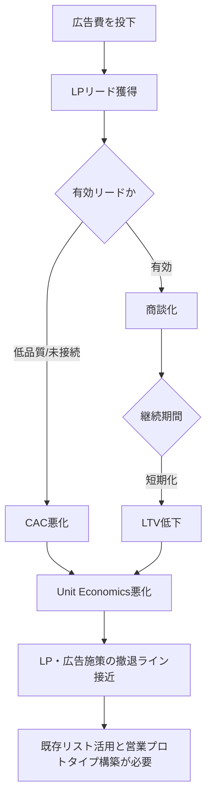
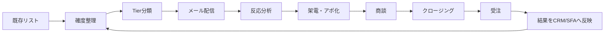
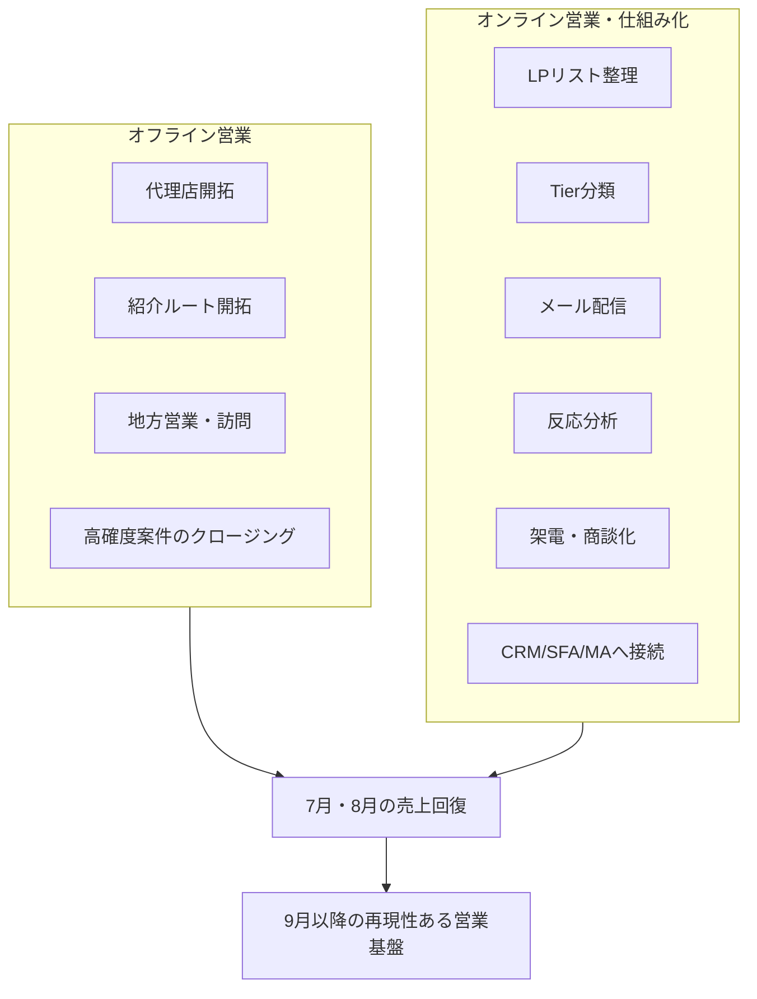
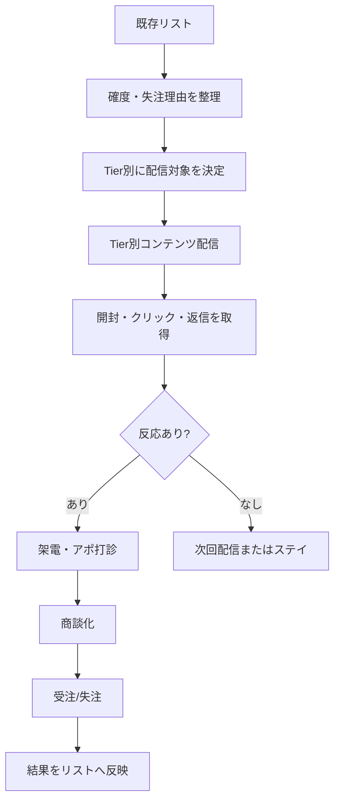
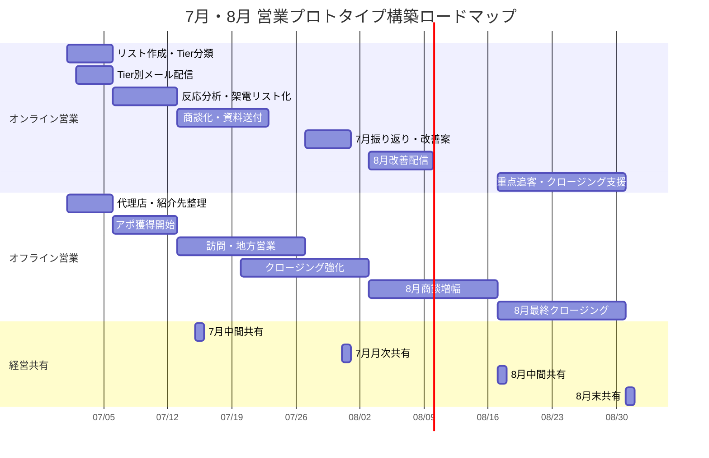
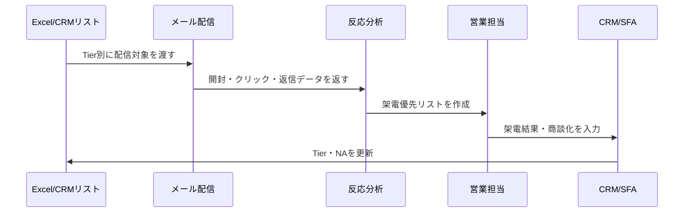

# トレプロ営業プロトタイプ Web要件定義書

> 目的：営業方針・現状認識・週次ロードマップ・Tier運用を、社長・営業責任者・実行メンバーが同じ画面で確認できるWebドキュメントとして整理する。  
> 想定公開：GitHub Pages / Vercel / Netlify などの静的サイト公開。  
> 想定閲覧環境：スマートフォン、タブレット、PC。

---

## 0. このドキュメントで作るもの

### ゴール

トレプロの営業活動を、短期の売上創出と中長期の仕組み化の両面から整理し、7月・8月の行動計画を週次で追えるWebページにする。

### サイトで伝える主メッセージ

```text
広告依存だけで新規獲得を続ける状態から、
オフライン営業とオンライン営業を組み合わせ、
既存リストを営業資産として活用する営業プロトタイプへ移行する。
```

### 最初に見せるべき内容

1. 現状の営業課題
2. 目指す営業体制
3. オフライン・オンラインの役割分担
4. 7月第1週からの週次ロードマップ
5. Tier運用の前提となる確度・優先度ルール
6. Tier別アプローチ方針
7. KPI・CAC改善の見方
8. 実行メンバーの動き方

---

## 1. サイト全体の情報設計

### 推奨ページ構成

Markdownは1ファイルでも成立するが、GitHub Pages化する場合は以下のページ分割を推奨する。

```text
/
├── index.md                    # 全体方針・サマリー
├── current-state.md             # 現状認識・CAC悪化・営業課題
├── strategy.md                  # オフライン / オンライン営業方針
├── roadmap.md                   # 7月・8月週次ロードマップ
├── tier-design.md               # 確度ルール・Tier設計
├── operation.md                 # メール配信・架電・商談運用
├── kpi.md                       # KPI / CAC / LTV / Unit Economics
└── implementation-notes.md      # 実装・レスポンシブ・図解指示
```

### 1ページ版にする場合の表示順

```text
1. Hero：営業プロトタイプ構築方針
2. Executive Summary：3つの要点
3. Current State：現状の危機感
4. Ideal State：目指す営業体制
5. Strategy：オフライン / オンラインの二軸
6. Weekly Roadmap：7月第1週から8月末まで
7. Foundation：確度・優先度・失注理由の整理
8. Tier Design：Tier1〜4の定義
9. Operation：メール配信・架電・商談・クロージング
10. KPI：CAC改善と判断指標
11. Roles：担当者別の役割
12. Next Action：直近48時間 / 1週間の実行項目
```

---

## 2. デザイン・レスポンシブ要件

### 基本方針

- 社長がスマホでも全体感を掴めることを最優先にする。
- PCでは、図解・表・カードを使って全体構造を一目で見せる。
- Markdown本文をそのままWeb化しても読みやすいよう、見出し階層と表を明確にする。
- 文章量が多い箇所は、カード・図・表に置き換える。

### 推奨トーン

| 項目 | 方針 |
|---|---|
| 色 | 白背景、黒・濃いグレー文字、アクセントにトレプロ系の朱色・赤系 |
| フォント | Noto Sans JP / system-ui |
| レイアウト | PCは最大幅1120px、スマホは1カラム |
| UI | カード、ステップ、ロードマップ、KPIチップ、フローチャート |
| 余白 | セクション間は広め。スマホで詰まらないようにする |
| 表 | PCは横表、スマホはカード化または横スクロール |

### ブレイクポイント

```css
/* 実装時の目安 */
:root {
  --max-width: 1120px;
  --accent: #E64628;
  --text: #222222;
  --muted: #666666;
  --bg: #FFFFFF;
  --soft-bg: #F7F7F7;
  --border: #E5E5E5;
}

/* mobile first */
.container { width: min(100% - 32px, var(--max-width)); margin: 0 auto; }
.grid-2 { display: grid; grid-template-columns: 1fr; gap: 16px; }
.grid-3 { display: grid; grid-template-columns: 1fr; gap: 16px; }

@media (min-width: 768px) {
  .grid-2 { grid-template-columns: repeat(2, 1fr); }
  .grid-3 { grid-template-columns: repeat(3, 1fr); }
}

@media (min-width: 1024px) {
  .section { padding: 72px 0; }
}
```

---

## 3. Heroセクション要件

### 表示内容

#### タイトル

```text
トレプロ営業プロトタイプ構築方針
```

#### サブタイトル

```text
オフライン営業とオンライン仕組み化を両輪に、7月・8月で営業回復の型を作る
```

#### 3つのサマリーカード

| カード | 表示内容 |
|---|---|
| 現状 | LP・広告経由のCACが悪化し、広告単体では回復幅が限定的 |
| 方針 | オフライン営業で短期売上を作り、オンラインで既存リストを資産化 |
| 直近実行 | 7月第1週からリスト整理・Tier別メール配信・反応分析を開始 |

### ビジュアル指示

- Hero直下に3枚の横並びカードを配置。
- スマホでは縦並び。
- 各カードには短いアイコンを入れる。
  - 現状：警告アイコン
  - 方針：方位磁針アイコン
  - 実行：チェックリストアイコン

---

## 4. 現状認識セクション

### 4-1. 表示すべきメッセージ

現在の課題は、単にアポ数や成約数が少ないことではなく、顧客獲得にかかるコストと、そこから回収できるLTVのバランスが悪化していることにある。

広告施策は一定の改善余地があるものの、短期で大きな回復を狙うには、過去に接点を持った既存リストへの再アプローチを同時に進める必要がある。

### 4-2. KPIカード

| KPI | 表示例 | 補足 |
|---|---:|---|
| 過去CAC | 約60万円 | 過去に高効率で獲得できていた状態 |
| 現在CAC | 約200万円〜330万円 | 入力データ・集計条件により要精査 |
| 過去LTV期間 | 約18ヶ月 | 平均継続期間の目安 |
| 現在LTV期間 | 約10ヶ月 | 継続期間の低下 |
| 判断ライン | LTV / CAC = 3倍以上 | 営業施策継続の目安 |
| 直近重点 | 7月・8月で回復 | LP撤退ラインに入る前の改善期間 |

### 4-3. 推奨グラフ1：CAC悪化の棒グラフ

#### グラフ種類

棒グラフ

#### 表示内容

```json
{
  "labels": ["過去", "現在"],
  "datasets": [
    {
      "label": "CAC",
      "data": [60, 200],
      "unit": "万円"
    }
  ]
}
```

#### 表示意図

- 過去と現在の獲得コストの差を直感的に見せる。
- 現在値はExcelの最新集計に合わせて可変にする。

### 4-4. 推奨グラフ2：LTV期間の比較

#### グラフ種類

横棒グラフ

#### 表示内容

```json
{
  "labels": ["過去平均", "現在平均"],
  "datasets": [
    {
      "label": "平均継続期間",
      "data": [18, 10],
      "unit": "ヶ月"
    }
  ]
}
```

#### 表示意図

- CAC上昇だけでなく、LTV低下も同時に起きていることを見せる。

### 4-5. 推奨図解：現状の悪化構造

#### Mermaid指定



### 4-6. 実装メモ

- PCでは左に説明文、右に2つのグラフを縦並び。
- スマホでは「説明文 → KPIカード → グラフ」の順で表示。
- 数値は将来的にJSONファイルから読み込めるようにする。

---

## 5. 目指す理想状態セクション

### 5-1. 表示すべきメッセージ

目指す状態は、広告費をかけ続けなくても、既存リスト・営業資料・メール配信・架電・商談管理を通じて、継続的に商談と受注を生み出せる営業体制である。

### 5-2. 理想状態カード

| 領域 | 目指す状態 |
|---|---|
| 売上創出 | オフライン営業で短期受注を作る |
| リスト活用 | LP経由・過去商談を営業資産化する |
| 再現性 | 人が増えても同じ手順で動ける |
| 競争優位 | SNS運用代行ではなく採用支援領域で勝つ |
| 管理 | CAC・商談化率・受注率を見て改善する |
| 資料 | 稟議・税理士・役員会でも使える資料を整える |

### 5-3. 推奨図解：目指す営業モデル



### 5-4. 推奨ビジュアル

- PC：横長の循環フロー図。
- スマホ：縦方向のステップ表示。
- 重要なポイントとして「受注後にCRM/SFAへ戻す」ループを表示する。

---

## 6. 営業戦略の二軸セクション

### 6-1. 二軸の基本整理

| 軸 | 主担当 | 目的 | 主な動き |
|---|---|---|---|
| オフライン営業 | 橋口さん | 短期売上を作る | 代理店、紹介、地方営業、訪問、クロージング |
| オンライン営業・仕組み化 | 小池 | 既存リストを営業資産化する | LPリスト整理、Tier設計、メール配信、CRM/SFA/MA設計 |

### 6-2. 推奨図解：2レーン構造



### 6-3. 表示意図

- オフラインとオンラインを対立軸にしない。
- 短期売上と中長期基盤を同時に作る構造として見せる。
- 社長が見たときに「誰がどこを担当するか」がすぐ分かるようにする。

---

## 7. オンライン営業・マーケティングのあるべき姿

### 7-1. 基本思想

オンライン営業は、単なる一斉メール配信ではなく、既存リストを営業資産に変えるための仕組みである。

### 7-2. あるべき姿

| 項目 | あるべき状態 |
|---|---|
| リスト管理 | LP経由・代理店経由・紹介経由が判別できる |
| 確度管理 | 10%、20%、40%、60%の意味が統一されている |
| 優先順位 | 決裁者接点、議事録の濃さ、失注理由で並べ替えられる |
| 配信 | Tierごとに送るコンテンツが変わる |
| 分析 | 開封、クリック、返信、架電結果が見える |
| 商談化 | 反応企業を優先的に営業が追える |
| 継続接点 | 業界別ニュースやホワイトペーパーで接点を残す |
| 学習 | 反応率・商談化率を次回施策に反映する |

### 7-3. 推奨図解：オンライン営業のファネル



### 7-4. 推奨グラフ：ファネル分析

#### グラフ種類

ファネルチャート

#### 指標

| 指標 | 内容 |
|---|---|
| 配信対象数 | Tier別に配信した件数 |
| 開封数 | メール開封数 |
| クリック数 | 資料リンク・LPクリック数 |
| 返信数 | 返信あり件数 |
| 架電接続数 | 電話がつながった件数 |
| アポ数 | アポイント獲得数 |
| 商談数 | 実施商談数 |
| 受注数 | 成約数 |

---

## 8. 週次ロードマップ要件

### 8-1. 表示方針

月単位ではなく、7月第1週から週次で「何をするか」「誰が担当するか」「成果物は何か」を追えるようにする。

### 8-2. 7月・8月ロードマップ一覧

| 期間 | フェーズ | オンライン営業 | オフライン営業 | 成果物 |
|---|---|---|---|---|
| 7月第1週<br>7/1(水)〜7/5(日) | 初動設計・配信開始 | リスト作成、Tier分類、Tier別メール配信、反応計測開始 | 代理店・紹介先の再整理、訪問候補の洗い出し | 配信リスト、Tier分類表、初回配信ログ |
| 7月第2週<br>7/6(月)〜7/12(日) | アポ獲得開始 | 開封・クリック・返信分析、Tier1/2架電リスト作成、営業チームへ連携 | アポ獲得、訪問打診、代理店経由の商談創出 | アポ候補一覧、架電結果、商談予定 |
| 7月第3週<br>7/13(月)〜7/19(日) | 商談実施 | 反応企業の商談化、資料送付、未反応層への再配信設計 | 商談実施、地方営業、紹介経由クロージング | 商談実施リスト、追加資料リスト |
| 7月第4週<br>7/20(月)〜7/26(日) | クロージング強化 | Tier1/2-Aの個別追客、稟議・税理士向け資料整備 | 重点案件クロージング、条件調整 | 受注見込み一覧、クロージングリスト |
| 7月第5週<br>7/27(月)〜7/31(金) | 月次振り返り | 配信結果・商談化率・CAC仮集計、8月改善案作成 | 代理店成果・紹介成果の整理 | 7月振り返り、8月打ち手一覧 |
| 8月第1週<br>8/3(月)〜8/9(日) | 改善配信 | 7月反応データをもとに文面改善、Tier2/3再配信 | 7月商談の再訪問・再提案 | 改善版メール、再配信リスト |
| 8月第2週<br>8/10(月)〜8/16(日) | 商談増幅 | クリック・返信企業への架電、Tier昇格処理 | 地方・代理店経由の商談増加 | 追加アポ、Tier昇格一覧 |
| 8月第3週<br>8/17(月)〜8/23(日) | 重点提案 | 役員会・稟議・税理士向け資料の送付 | 高確度案件の提案・条件調整 | 重点提案資料、クロージング予定 |
| 8月第4週<br>8/24(月)〜8/30(日) | 8月クロージング | 受注見込み先の最終追客、9月継続対象の整理 | 受注確定、代理店施策の振り返り | 8月受注結果、9月移行リスト |
| 8月第5週<br>8/31(月) | 経営共有 | CAC・商談化率・受注率の整理 | オフライン成果共有 | 9月以降の営業プロトタイプ提案 |

### 8-3. 推奨図解：週次ガントチャート



### 8-4. スマホ表示要件

- ガントチャートはスマホでは横スクロール可にする。
- もしくは週ごとのカード形式に切り替える。
- 各週カードには以下を表示する。
  - 週番号
  - 期間
  - 目的
  - オンライン実行内容
  - オフライン実行内容
  - 成果物

---

## 9. 土台設計：確度・優先順位・失注理由

### 9-1. 確度ルール

| 成約角度 | 定義 | 主な状態 |
|---:|---|---|
| 60% | 具体提案・料金・導入時期が見えている | クロージング対象 |
| 40% | 課題が明確で、再商談・訪問で前進する | 高優先商談化対象 |
| 20% | 過去接点があり、掘り起こしで再商談化余地あり | 掘り起こし重点対象 |
| 10% | 温度感は低いが接点維持価値あり | ナーチャリング対象 |
| 0% / NG | 明確NG、電話NG、対象外 | ステイ |
| 空白 | 判断材料不足 | 情報補完またはステイ |

### 9-2. 優先順位の補助軸

成約角度だけではなく、以下で優先度を補正する。

| 補助軸 | 優先度が上がる条件 |
|---|---|
| 決裁者接点 | 代表・役員・部長クラスと接触済み |
| 議事録の濃さ | 課題・予算・時期・懸念が残っている |
| 失注理由 | 金額・他社・時期など再提案の切り口が明確 |
| 業界適合 | 建設、運送、警備、現場職などSNS採用と相性がよい |
| 資料反応 | 開封・クリック・返信がある |
| 次回行動 | いつ何をするかNAが明確 |

### 9-3. 失注理由分類

| 失注理由 | 再アプローチ方針 | 送付すべき資料 |
|---|---|---|
| 金額 | 採用単価・長期コスト比較で再提案 | 料金表、採用単価比較資料 |
| 他社決定 | 他社導入後の成果確認 | 他社比較資料、事例集 |
| 時期未定 | 採用計画の確認 | 会社資料、業界別レポート |
| 稟議停止 | 社内説明の支援 | 役員会・税理士向け資料 |
| 自然消滅 | 情報提供から接点復活 | ホワイトペーパー、事例集 |
| 不通 | メール反応を見て架電 | ホワイトペーパー、会社資料 |
| 明確NG | ステイ | 送付しない |

---

## 10. Tier設計要件

### 10-1. Tierの基本定義

| Tier | 成約角度 | 目的 | 初回アクション |
|---|---:|---|---|
| Tier 1 | 40%以上 | 短期受注・商談化 | 事例集＋料金表＋アポ打診 |
| Tier 2 | 20% | 掘り起こし・再商談化 | 会社資料＋アポ打診 |
| Tier 3 | 10% | 接点維持・ナーチャリング | ホワイトペーパー送付 |
| Tier 4 | それ以外 | ステイ | 何もしない |

### 10-2. Tier 2内の詳細分類

| 詳細Tier | 条件 | 対応方針 |
|---|---|---|
| Tier 2-A | 決裁者接点あり、議事録詳細、再提案余地あり | 送付後すぐ架電。商談化したらTier1へ昇格 |
| Tier 2-B | 担当者接点あり、情報はあるが決裁・時期が不明 | 開封・クリック後に架電。情報補完を優先 |
| Tier 2-C | 20%だが進捗・メモが薄い | メール反応を確認。TLTV/議事録で再判定 |

### 10-3. 推奨図解：Tierマトリクス

#### 図解内容

- 横軸：成約角度
- 縦軸：情報の濃さ / 決裁者接点
- 右上ほど優先度が高い

```text
縦軸：情報の濃さ・決裁者接点
高い ↑
     | Tier 2-A        Tier 1
     | Tier 2-B        Tier 1候補
     | Tier 3          Tier 2-C
低い +----------------------------→ 成約角度
       10%           20%        40%以上
```

### 10-4. 推奨グラフ：Tier別件数の円グラフ

#### グラフ種類

円グラフ、またはドーナツチャート

#### データ例

```json
{
  "labels": ["Tier 1", "Tier 2", "Tier 3", "Tier 4"],
  "datasets": [
    {
      "label": "Tier別件数",
      "data": [0, 0, 0, 0]
    }
  ]
}
```

#### 実装指示

- Excel集計後に実数を反映する。
- 初期表示はダミー値ではなく、未入力の場合は「集計中」と表示する。

---

## 11. メール配信要件

### 11-1. Tier別配信方針

| Tier | 配信目的 | 送付物 | CTA |
|---|---|---|---|
| Tier 1 | アポ化・クロージング | 1枚画像の事例集、料金表 | アポ打診 |
| Tier 2 | 再商談化 | 会社資料 | アポ打診 |
| Tier 3 | 接点維持 | ホワイトペーパー | 資料確認・興味確認 |
| Tier 4 | ステイ | 送らない | なし |

### 11-2. メール配信の状態管理

| ステータス | 定義 | 次アクション |
|---|---|---|
| 未送付 | まだ送っていない | 配信対象に入れる |
| 送付済 | メール送信済み | 開封確認 |
| 開封 | メール開封あり | Tierに応じて架電候補 |
| クリック | 資料クリックあり | 優先架電 |
| 返信 | 返信あり | 即アポ調整 |
| 不通 | 架電したがつながらない | 再架電 or メール再送 |
| 商談化 | アポ獲得済み | 商談担当へ引き継ぎ |
| 失注 | 明確にNG | 失注理由を記録 |

### 11-3. 配信・分析フロー



---

## 12. KPI / CAC管理要件

### 12-1. 主要KPI

| KPI | 内容 | 目的 |
|---|---|---|
| 配信数 | Tier別に送った件数 | 活動量確認 |
| 開封率 | 開封数 / 配信数 | 件名・対象精度確認 |
| クリック率 | クリック数 / 配信数 | コンテンツ関心度確認 |
| 返信率 | 返信数 / 配信数 | アポ化可能性確認 |
| 架電接続率 | 接続数 / 架電数 | 電話リスト精度確認 |
| アポ率 | アポ数 / 架電数 | 営業効率確認 |
| 商談化率 | 商談数 / 配信数 | リスト活用効率確認 |
| 受注率 | 受注数 / 商談数 | クロージング確認 |
| CAC | 営業・マーケ費用 / 新規獲得数 | 採算性確認 |
| LTV/CAC | LTV / CAC | 継続判断 |

### 12-2. 推奨グラフ：週次KPI推移

#### グラフ種類

折れ線グラフ

#### 指標

- 配信数
- 開封率
- 返信率
- アポ数
- 商談数
- 受注数

### 12-3. 推奨グラフ：CACとLTV/CAC倍率

#### グラフ種類

複合グラフ

- 棒：CAC
- 線：LTV/CAC倍率
- 目標ライン：3.0倍

#### データ例

```json
{
  "labels": ["7月第1週", "7月第2週", "7月第3週", "7月第4週", "8月第1週"],
  "datasets": [
    {
      "type": "bar",
      "label": "CAC",
      "data": [null, null, null, null, null],
      "unit": "万円"
    },
    {
      "type": "line",
      "label": "LTV/CAC倍率",
      "data": [null, null, null, null, null],
      "unit": "倍"
    }
  ],
  "targetLine": 3.0
}
```

---

## 13. 役割分担要件

### 13-1. 役割一覧

| 役割 | 担当 | 主な責任 |
|---|---|---|
| 全体方針・経営判断 | 金山さん | 投資判断、重要案件判断、全体確認 |
| オフライン営業 | 橋口さん | 代理店、紹介、地方営業、短期売上創出 |
| オンライン営業・仕組み化 | 小池 | リスト活用、配信設計、Tier設計、CRM/SFA/MA接続 |
| 新規営業担当2名 | 新メンバー | Tier2/3への一次接触、架電、情報補完 |
| 配信・運用補助 | 森谷さん等 | 配信準備、リスト整理、反応抽出、入力補助 |

### 13-2. RACI表

| タスク | 金山 | 橋口 | 小池 | 新規営業2名 | 運用補助 |
|---|---|---|---|---|---|
| 全体方針決定 | A | C | R | I | I |
| オフライン営業設計 | C | A/R | C | I | I |
| リスト整理 | I | C | A/R | R | R |
| Tier定義 | C | C | A/R | I | I |
| メール配信設計 | I | C | A/R | C | R |
| 架電実行 | I | C | A | R | I |
| 商談実施 | C | R | R | C | I |
| クロージング | A | R | R | I | I |
| KPI集計 | I | C | A/R | C | R |

> A = Accountable / 最終責任  
> R = Responsible / 実行責任  
> C = Consulted / 相談  
> I = Informed / 共有

---

## 14. 実装要件

### 14-1. Markdown運用

- 原稿はMarkdownで管理する。
- GitHubにアップロードし、Pull Requestで更新履歴を残す。
- 週次ロードマップは毎週更新できるようにする。
- KPIデータは将来的にJSONまたはCSVで分離する。

### 14-2. 推奨技術構成

#### 最小構成

```text
GitHub Pages + Markdown + Mermaid
```

#### 推奨構成

```text
Astro または VitePress
├── Markdown管理
├── Mermaid対応
├── Chart.js / EChartsでグラフ表示
├── レスポンシブCSS
└── GitHub Pages / Vercelで公開
```

### 14-3. ディレクトリ例

```text
trepro-sales-prototype/
├── README.md
├── package.json
├── docs/
│   ├── index.md
│   ├── current-state.md
│   ├── strategy.md
│   ├── roadmap.md
│   ├── tier-design.md
│   ├── kpi.md
│   └── operation.md
├── public/
│   └── images/
├── src/
│   ├── components/
│   │   ├── KpiCard.astro
│   │   ├── RoadmapCard.astro
│   │   ├── TierMatrix.astro
│   │   └── ChartBlock.astro
│   └── data/
│       ├── kpi.json
│       ├── roadmap.json
│       └── tier-summary.json
└── styles/
    └── global.css
```

---

## 15. 各セクションのビジュアル対応表

| セクション | 推奨ビジュアル | 目的 |
|---|---|---|
| Hero | 3カード | 方針を一目で把握 |
| 現状認識 | KPIカード、棒グラフ、横棒グラフ | CAC悪化とLTV低下を可視化 |
| 悪化構造 | フローチャート | 広告費投下から撤退ライン接近までを説明 |
| 目指す姿 | 循環フロー | 営業プロトタイプの全体像を表現 |
| 二軸戦略 | 2レーン図 | オフライン/オンラインの役割分担を明示 |
| 週次計画 | ガントチャート、週次カード | 7月第1週から行動を追えるようにする |
| Tier設計 | マトリクス、表、円グラフ | 優先順位と配信対象を整理 |
| メール運用 | シーケンス図 | 配信からCRM反映までを説明 |
| KPI | 折れ線、複合グラフ、ファネル | 改善状況を数値で追う |
| 役割分担 | RACI表 | 誰が何を担うかを明確化 |

---

## 16. Cursorエージェント向け実装指示

以下をCursorに貼り付けて実装指示として使えるようにする。

```text
このMarkdown要件定義書をもとに、GitHub PagesまたはVercelで公開できるレスポンシブWebサイトを作成してください。

要件：
- スマホ、タブレット、PCで見やすいレスポンシブ対応にすること
- Markdown本文をベースにしつつ、重要箇所はカード、表、図解、ロードマップで視覚化すること
- Mermaidのフローチャート・ガントチャートを表示できるようにすること
- KPIカード、Tierカード、週次ロードマップカードをコンポーネント化すること
- Chart.jsまたはEChartsで、CAC比較、LTV比較、Tier別件数、週次KPI推移、ファネル分析を表示できる構成にすること
- 初期データはJSONで管理し、後からExcel集計値に差し替えられるようにすること
- デザインは白背景、濃いグレー文字、アクセントカラーは朱色系にすること
- 社長がスマホで見ても、全体方針・現状・今週やることがすぐ分かる構成にすること
- READMEにローカル起動方法、ビルド方法、GitHub Pages公開手順を書くこと
```

---

## 17. 直近48時間の実行項目

### 7月第1週の初動

| 優先度 | 実行項目 | 担当 | 成果物 |
|---|---|---|---|
| 高 | アポ進捗シートのリスト抽出 | 小池 | LP / D / 紹介の分類リスト |
| 高 | 確度10/20/40/60の件数集計 | 小池 | 確度別件数表 |
| 高 | Tier1〜4の仮分類 | 小池 | Tier分類済みリスト |
| 高 | Tier別メール文面・送付物準備 | 小池 / 運用補助 | メールテンプレート |
| 高 | Tier1へ事例集＋料金表送付 | 小池 / 新規営業 | 配信ログ |
| 高 | Tier2へ会社資料送付 | 小池 / 新規営業 | 配信ログ |
| 中 | Tier3へホワイトペーパー送付 | 小池 / 運用補助 | 配信ログ |
| 中 | 反応計測方法の確認 | 小池 / 配信担当 | 開封・クリック確認手順 |
| 中 | オフライン営業候補整理 | 橋口さん | 代理店・訪問候補一覧 |

---

## 18. 完了条件

このWebドキュメントの初版は、以下を満たしたら完了とする。

- 全体方針がHeroとサマリーで伝わる
- 現状のCAC悪化と既存リスト活用の必要性が伝わる
- オフライン / オンラインの役割分担が明確になっている
- 7月第1週から8月末までの週次ロードマップがある
- Tier設計に入る前の土台が整理されている
- Tier1〜4の初期定義がある
- メール配信・架電・商談化の流れが図解されている
- KPI・CACを週次で追える構成になっている
- スマホ、タブレット、PCで読みやすい
- Cursorで実装に移せる具体指示が入っている

